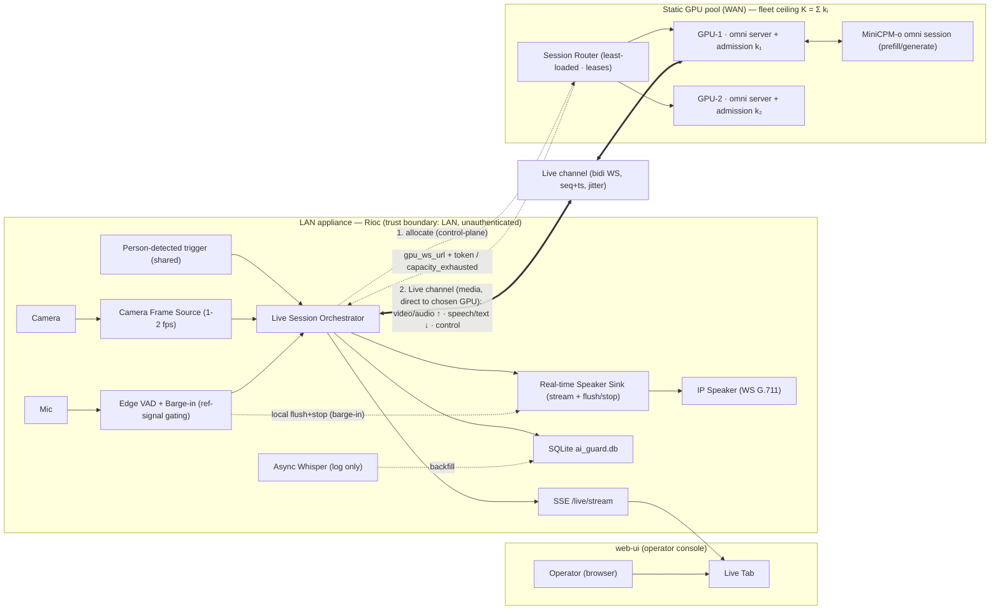

# Live Multimodal Guard — Design

> Status: **Design (approved in dialogue 2026-08-01)** — pending architecture-review + prototype sign-off before implementation.
> Spans two repos: **rioc** (backend, primary) and **web-services/web-ui** (operator console).
> Sibling to the existing turn-based conversation engine; does not replace it.

## 1. Problem

Today the AI Guard conducts a conversation with an intruder as a sequence of **stateless request/response turns**: one JPEG frame + one WAV of the person's reply go to MiniCPM-o via vLLM's OpenAI-compatible `/v1/chat/completions`, one text+audio response comes back, then the mic opens for the next turn. It is strictly half-duplex, snapshot-in / snapshot-out.

This throws away MiniCPM-o's headline capability — its **omni streaming mode**, where a persistent session ingests continuous video frames *and* rolling audio while emitting streaming speech in real time. The goal is a **live, full-duplex, back-and-forth voice conversation** with an AI that is genuinely *watching and listening* to the scene continuously, not reacting to a single still frame per turn.

The single frame is a symptom; the real limitation is the stateless request/response pipeline. vLLM's OpenAI endpoint cannot hold a streaming session. Reaching true live interaction requires a persistent omni session on the GPU.

## 2. Goals / Non-goals

**Goals**
- A new **"Live mode"** conversation engine driving a persistent MiniCPM-o omni session.
- **Full-duplex** interaction: the guard streams speech while watching; the person can **barge in** (interrupt) and the guard yields.
- Continuous video (~1–2 fps) + continuous mic audio streamed into one session; streaming speech + text streamed back.
- End-to-end MiniCPM-o for the live path — **no Whisper/OpenAI-TTS on the critical path**.
- Coexist with the deployed turn-based engine, selected per appliance by config; shared person-detection trigger.
- Operator console **Live tab**: live video, streaming captions, turn / barge-in / state indicators, start/stop, connection + capacity status.

**Non-goals (this iteration)**
- **Elastic autoscaling** — dynamically spinning GPU instances up/down with load. Multi-GPU capacity IS in scope as a **static, operator-configured pool** distributed by the Session Router (§4.1); adding/removing GPUs is a manual infra op, not automatic. Overflow errors out only when the whole pool is at its measured ceiling.
- Automatic fallback from live → turn-based on overflow or error (explicitly rejected).
- Replacing the turn-based engine.
- Full acoustic echo cancellation (reference-signal gating for MVP; AEC is a later upgrade).
- Multi-camera / multi-speaker per session (single-camera, single-speaker, matching current MVP scope).

## 3. Locked decisions

| Decision | Choice | Rationale |
|---|---|---|
| Serving | Native MiniCPM-o **omni streaming server** (new process on the GPU box) | We control the GPU host; vLLM's stateless endpoint cannot hold an omni session. |
| Interaction | **Full-duplex, barge-in** | The target experience; person can interrupt, guard can interject. |
| Scope | **New parallel Live mode**, coexists with turn-based | Keeps the proven, deployed path as a manual fallback; lets us A/B. |
| Co-location | **Remote GPU (VPN/WAN/cloud)**; Rioc stays LAN media hub | Matches actual deployment: one central cloud GPU serving all sites. |
| Concurrency / overflow | **Static GPU pool behind a Session Router**; fleet ceiling K = Σ per-GPU `LIVE_MAX_SESSIONS` (each > 1); router allocates the least-loaded GPU (control-plane only — media flows Rioc↔GPU directly); `capacity_exhausted` **only when the whole pool is full**; no elastic autoscale, no fallback | Adding GPUs raises K linearly. Per-GPU admission protects each GPU's real-time quality; the router spreads load across the fleet. Overflow is surfaced, never silently dropped. |
| Echo handling | **Reference-signal gating** (MVP) | Rioc knows exactly what it is sending to the speaker; gate the mic against it. No heavy DSP. Clear upgrade path to AEC. |
| Person transcript (for log) | **Async Whisper, logging-only** | Omni mode hears the person but may not emit their words as text. Keep the live loop clean; backfill the log off the critical path. |
| Escalation | **Time/severity overlay** | Live turns are fuzzy; drive WARNING→ESCALATING→FINAL by elapsed time/severity so the UI state badge + outcome classification stay meaningful. |

### 3.1 The central-GPU consequence (important)

The one central cloud GPU is the shared brain for **every camera at every location**. Today the stateless path is fine because vLLM continuously batches short requests. A **full-duplex omni session is the opposite workload**: long-lived, stateful (KV cache), running a continuous generate loop — each admitted session consumes a real-time compute slice for its whole duration. So the GPU can run **many** concurrent live conversations, but **not unlimited** ones: there is a real ceiling K beyond which admitting another session would spike latency and break barge-in for everyone already talking.

Therefore:
- **K is the GPU's measured real-time omni-session ceiling** — determined by a benchmark on the target hardware (§11), **not** hardcoded. It is configurable via `LIVE_MAX_SESSIONS` and is **> 1**; the fleet is served up to that ceiling.
- The admission cap exists to **protect the quality** of admitted conversations, not to limit the fleet to one. Below K, every incident gets a live guard.
- `capacity_exhausted` fires **only at the true ceiling** — a simultaneous burst of more than K incidents across the whole fleet at once. Because incidents are bursty and short, this is a rare edge, not the normal case. That appliance then gets no live guard response for that incident; the operator retains the turn-based-mode option. No autoscale, no fallback (raising K by adding GPUs is the future lever).

## 4. Architecture (Approach B — smart edge + streaming GPU brain)

```
  LAN APPLIANCE (Rioc, per-site)                    WAN            REMOTE GPU (central)
  ┌───────────────────────────────────────┐                 ┌──────────────────────────┐
  │  Camera ─┐                             │                 │  Omni Streaming Server   │
  │  Mic ───┐│   ┌─────────────────────┐   │  Live channel   │  (new process)           │
  │         ▼▼   │ Live Session        │   │  (bidi WS)      │  ┌────────────────────┐  │
  │  ┌──────────►│ Orchestrator        │◄──┼════════════════►│  │ MiniCPM-o omni     │  │
  │  │Edge VAD/ │ │ (new; sibling of    │   │  video↑ audio↑  │  │ session (stateful) │  │
  │  │Barge-in  │ │  ConversationMgr)   │   │  ctrl↕          │  │ prefill / generate │  │
  │  │Controller│ └─────────┬───────────┘   │  speech↓ text↓  │  └────────────────────┘  │
  │  └────▲─────┘           │               │                 │  Fixed-K admission ctrl  │
  │       │       ┌─────────▼───────────┐   │                 └──────────────────────────┘
  │  Speaker◄─────│ Real-time Speaker   │   │
  │  (WS G.711)   │ Sink (extends       │   │                 web-ui: Live tab
  │               │ _guarded_play)      │   │  SSE ──────────► captions, state/turn/
  │               └─────────────────────┘   │  (/live/stream)  barge-in, capacity banner
  └───────────────────────────────────────┘
```

Real-time smarts live **at the edge** (Rioc), so barge-in does not pay the WAN round-trip. The model session lives on a **GPU in the central pool**, allocated per-conversation by the Session Router (§4.1). Rioc and the chosen GPU coordinate over a versioned bidirectional WebSocket ("the Live channel").

### 4.1 Multi-GPU routing (control-plane allocation)

The "central GPU" generalizes to a **static, operator-configured pool of GPU instances**, each running an Omni Streaming Server with its own local admission (per-GPU capacity `kᵢ`). A thin **Session Router** in front of the pool does fleet-wide allocation. Fleet ceiling **K = Σ kᵢ**; adding GPUs raises K linearly.

**Control-plane only — media is never proxied.** The router *allocates* a slot and returns the chosen GPU's **direct** WebSocket URL; Rioc then opens the Live channel **straight to that GPU**. The router stays out of the latency-critical media path — no extra WAN hop on video/audio/speech. This is the defining choice: routing is allocation, not proxying.

Flow:
1. On a person-detected trigger, Rioc calls `POST {router}/allocate {camera_id}`.
2. Router picks the **least-loaded healthy GPU** with a free slot, reserves it under a short **lease**, and returns `{gpu_ws_url, session_token, lease_ttl}`. If no GPU has a free slot → `capacity_exhausted` (the whole fleet is at its true ceiling).
3. Rioc opens the Live channel to `gpu_ws_url`, presenting `session_token`. The omni server validates the token, admits locally (backstop against races / direct-connects), and reports "live" to the router.
4. On session end/disconnect the omni server releases the slot to the router; a lease/heartbeat reclaims leaked slots if a GPU or Rioc dies.

**Consistency with prior decisions:** horizontal distribution across a **fixed** pool — not elastic autoscaling (still a non-goal). No fallback: an allocation failure or a mid-session GPU death surfaces `capacity_exhausted` / `error` exactly as before; the operator can drop to turn-based mode. Adding/removing GPUs is a manual infra op that changes K.

**New failure surface:** the router is a control-plane dependency for *starting* live sessions (existing direct connections keep running if it blips). Keep it small and quick-restarting; rebuild occupancy from GPU reports on restart; use short leases so a crash never permanently leaks slots. Turn-based mode never touches the router.

> Mermaid embed (convenience copy for inline repo rendering — the rendered `diagram`/`poster`/`explainer` HTML are the review artifacts):



## 5. Components

### GPU side

**5.1 Omni Streaming Server** — *new process, e.g. `omni_server.py` (deployed on the GPU box, not in the appliance)*
- Holds one stateful MiniCPM-o omni session per live conversation (`streaming_prefill` to ingest ~1s video+audio chunks; `streaming_generate` to emit streaming speech+text).
- Exposes a WebSocket endpoint speaking the Live-channel protocol (§6).
- **Generation is triggered by edge control messages** (`user_speech_end`), not server-side VAD — avoids double-VAD and WAN-delayed decisions. Server VAD exists only as a safety fallback if control messages stop arriving.
- On `interrupt`: aborts `streaming_generate`, discards queued output, keeps prefilling the person's incoming audio.
- Session lifecycle: create on `session_start` (primes guard persona/system prompt + voice), tear down on `session_end`/disconnect, enforce max-duration + idle timeout.
- **Responsibility boundary:** knows nothing about speakers, cameras, or the LAN. It is a media-in / media-out model session over a socket.

**5.2 Admission Control** — *part of each omni server (per-GPU)*
- Per-GPU capacity `kᵢ` (env `LIVE_MAX_SESSIONS`), sized to that GPU's **measured real-time ceiling** (`kᵢ` > 1). Grants a session or returns `capacity_exhausted` when all local slots are in use.
- Backstop against router races / direct connects. Reports in-use/capacity to the Session Router; emits a metric.

**5.2b Session Router** — *new control-plane service in front of the GPU pool*
- `POST /allocate {camera_id}` → reserves a slot on the **least-loaded healthy GPU** under a short lease, returns `{gpu_ws_url, session_token, lease_ttl}`; or `capacity_exhausted` when the whole pool is full.
- Tracks per-GPU occupancy (from allocate/release + omni-server reports), health-checks GPUs, reclaims leaked slots via lease/heartbeat. **Control-plane only — no media passes through it.**
- Static pool (operator-configured GPU list). Fleet ceiling K = Σ `kᵢ`. Small and quick-restarting; occupancy rebuildable from GPU reports.

### Transport

**5.3 Live Channel** — *versioned bidirectional WebSocket protocol (§6)*
- Uplink (Rioc→GPU) and downlink (GPU→Rioc) message schema with sequence numbers + timestamps for jitter buffering.

### LAN appliance (Rioc)

**5.4 Live Session Orchestrator** — *new, `live_session.py`; sibling to `conversation_manager.py`*
- Selected when `CONVERSATION_MODE=live`. Calls the **Session Router** to allocate a GPU, then owns the WS client to the returned `gpu_ws_url`.
- Wires camera frame source + mic capture + edge VAD + speaker sink to the Live channel.
- Manages session lifecycle (§7); owns the escalation-overlay timer; relays captions/turns/state to the UI SSE.
- Shared person-detection trigger (`on_person_detected`) dispatches to this **or** the turn-based `ConversationManager` based on mode.

**5.5 Edge VAD + Barge-in Controller** — *extends `mic_listener.py`*
- Runs webrtcvad **continuously** (not gated to listen-windows as the half-duplex path is).
- Emits `user_speech_start` / `user_speech_end` upstream.
- On person-speech-while-guard-speaking: fires **local barge-in** — commands the Speaker Sink to flush+stop immediately *and* sends `interrupt` upstream.
- **Reference-signal gating:** while the speaker is playing guard audio, gate mic input against the known outgoing signal / require energy above the echo floor, so the guard's own voice does not trip barge-in.

**5.6 Real-time Speaker Sink** — *extends the existing WebSocket G.711 path in `_guarded_play`*
- Plays a **stream** of speech chunks as they arrive (not a whole file), with a 200–400ms jitter buffer.
- Exposes a **flush-and-stop-now** primitive for barge-in.
- Streaming resample from MiniCPM-o's output rate → 8kHz μ-law.
- **Barge-in requires this WebSocket speaker path.** Play-from-URL speakers cannot be cleanly interrupted mid-utterance and are unsupported in live mode (config validation should refuse live mode for URL-only speakers).

**5.7 Camera Frame Source** — *reuse existing `_latest_conv_frame` / RTSP loop / `POST /api/frame-update`*
- Sample at ~1–2 fps into the uplink. No new capture code.

**5.8 Persistence** — *extend `db.py`*
- Same `conversations` / `conversation_turns` schema. Turns logged from `turn_start`/`turn_end` + `text` downlink (guard) and async-Whisper backfill (person). Outcome classification unchanged (Escalated / Left / Unknown), plus `Error` for aborted sessions.

### web-ui

**5.9 Live Tab** — *new component under `web-ui/src/admin/pages/accounts/ai-guard/components/`*
- Live MJPEG video (reuse `LiveStream`), streaming captions (guard text live; person text backfilled), state/turn/barge-in indicators, start/stop control, connection + **capacity-exhausted banner**.
- Consumes a new Rioc SSE relay `GET /live/stream` (mirrors the existing `useConversation` pattern) plus `POST /live/start`, `POST /live/stop`.
- **UI-bearing → goes through the prototype-first-ui gate before any UI code.**

**5.10 Mode routing / config**
- `CONVERSATION_MODE = turn_based | live` (env + `/configure` hot-swap). web-ui Configuration tab gains the toggle. Config validation forbids `live` when the selected speaker is URL-only (§5.6).

## 6. Live-channel protocol (v1)

All messages JSON envelopes with `{type, seq, ts, ...}`. Binary audio/video may ride as base64 in JSON for v1 (simplest); a binary-frame optimization is a later concern.

**Uplink (Rioc → GPU)**

| type | payload | notes |
|---|---|---|
| `session_start` | `{system_prompt, voice, camera_id, escalation_config}` | Primes the omni session. |
| `video` | `{jpeg_b64}` | ~1–2 fps. |
| `audio` | `{pcm_or_opus_b64}` | continuous while mic open; ~100–200ms frames. |
| `user_speech_start` | — | edge VAD; person began speaking. |
| `user_speech_end` | — | edge VAD; triggers `streaming_generate`. |
| `interrupt` | — | barge-in; abort current generation. |
| `session_end` | `{reason}` | teardown. |
| `ping` | — | keepalive/heartbeat. |

**Downlink (GPU → Rioc)**

| type | payload | notes |
|---|---|---|
| `session_ready` | `{session_id}` | admission granted + session primed. |
| `capacity_exhausted` | `{}` | admission refused; no session. |
| `speech` | `{audio_b64}` | streaming guard voice chunks. |
| `text` | `{delta}` | streaming guard transcript (captions + log). |
| `turn_start` / `turn_end` | `{}` | guard turn boundaries. |
| `interrupted` | `{}` | ack that generation was aborted. |
| `state` | `{state}` | if escalation state is surfaced from server; else Orchestrator owns it. |
| `error` | `{code, message}` | session-level error. |

Sequence numbers + timestamps let the downlink jitter buffer reorder/pace speech, and let the uplink tolerate dropped video frames.

## 7. Session lifecycle

1. **Trigger + allocate** — person detected (shared trigger). Orchestrator (`mode=live`) calls `POST {router}/allocate`; router returns the least-loaded GPU's `gpu_ws_url` + `session_token`, or `capacity_exhausted` if the whole pool is full.
2. **Admission** — Orchestrator opens the Live channel to `gpu_ws_url` with the token; per-GPU admission grants (`session_ready`) or refuses (`capacity_exhausted` race) → surface banner + event-log entry + metric, stop. No live conversation on overflow.
3. **Open** — send `session_start`; server primes persona + voice; `session_ready`.
4. **Run** (concurrent pumps) — frames ↑ @1–2fps; mic audio ↑ continuously; edge VAD emits speech-start/end; server prefills, and on `user_speech_end` runs `streaming_generate` → speech+text ↓; Speaker Sink plays with jitter buffer; captions relayed to UI; turns logged.
5. **Escalation overlay** — Orchestrator timer advances WARNING→ESCALATING→FINAL by elapsed time/severity, pushes `state` to the UI, and re-anchors the system prompt so tone matches.
6. **End** — scene clear for N sec / max duration / operator stop / error → `session_end`; server frees the slot; outcome classified + persisted; async Whisper backfills person-turn text.

## 8. Barge-in — critical path

```
guard speaking (speaker playing downlink speech)
  person starts talking
   → edge VAD fires  user_speech_start                     LOCAL  ~10–30ms
       ├─ Speaker Sink: flush jitter buffer + stop NOW      LOCAL  instant  ◄── guard goes quiet
       └─ send `interrupt` upstream                          WAN   ~50–200ms
   → server aborts streaming_generate, discards queued speech
       └─ acks `interrupted`, keeps prefilling person audio
   → on user_speech_end → streaming_generate → new reply streams down
```

The person never hears the WAN lag because the **speaker stop is local** — the guard falls silent in tens of ms while the model-side abort races over the WAN in the background. Reference-signal gating (§5.5) prevents the guard's own voice from triggering this.

## 9. Error handling

| Condition | Behavior |
|---|---|
| `capacity_exhausted` | UI banner + event-log entry + metric; no session. First-class, never silent. |
| WS disconnect / GPU crash mid-session | Heartbeat timeout → Orchestrator stops speaker, ends conversation with outcome `Error`, surfaces it. **No auto-fallback**; operator may manually switch appliance to turn-based. |
| WAN jitter / loss | Downlink speech jitter buffer (200–400ms); uplink audio sequence numbers; dropped video frames tolerated (1–2fps, lossy-fine). |
| Async Whisper failure | Turn logged with empty text; non-fatal. |
| False barge-in (echo slips gating) | Guard re-generates; acceptable MVP degradation. |
| Live mode + URL-only speaker | Config validation refuses; operator must use a WS-capable speaker or turn-based mode. |

## 10. Testing

- **Omni server:** unit-test session state machine + admission (grant / `capacity_exhausted`) against a mock model; real-model smoke test of the streaming loop.
- **Live channel:** protocol contract tests (message schemas, seq handling) with a fake client/server pair.
- **Edge VAD / barge-in:** recorded fixtures — guard-only, person-only, overlapping — assert `interrupt` fires only on genuine person speech above the echo floor; measure fire latency.
- **Speaker sink:** flush-and-stop latency; streaming resample correctness.
- **Integration (lab):** scripted end-to-end with a simulated-intruder audio track + canned frames against a real omni session; measure barge-in responsiveness and round-trip latency.
- **UI Live tab:** reuse qa-loop persona user-story catalog; one tagged Playwright spec per story.

## 11. Open items to resolve during architecture-review / planning

- Confirm the exact MiniCPM-o streaming API surface (`streaming_prefill` / `streaming_generate` signatures, session handling, voice config) against the pinned model version on the GPU box.
- **Benchmark per-GPU `kᵢ`** — measure how many simultaneous full-duplex omni sessions one GPU sustains at real-time latency (barge-in intact), and set `LIVE_MAX_SESSIONS` from it. Fleet ceiling K = Σ `kᵢ`. Re-run when GPU class or model changes.
- **Session Router specifics** — lease TTL, allocation policy (least-loaded vs. bin-pack), GPU registration (static list vs. self-register), and router HA (single instance quick-restart vs. replicated). Sketch is in §4.1; tune during planning.
- Decide uplink audio codec (raw PCM vs Opus) against WAN bandwidth budget.
- Endpointing tuning: how much trailing silence = `user_speech_end` before triggering generation.
- Escalation-overlay thresholds (time to ESCALATING / FINAL, max session duration).
- Whether `state` is owned solely by the Orchestrator (recommended) or partly emitted by the server.

## 12. Next workflow steps (per standard delivery loop)

1. **architecture-review** — render the diagram + poster artifacts for this design.
2. **prototype-first-ui** — design direction → clickable Live-tab prototype → `prototype/SIGNOFF.md`.
3. **writing-plans** — implementation plan (backend omni server + orchestrator first, UI after prototype sign-off).
4. Build with qa-loop as each slice's exit gate; prd-verification as the final gate.
